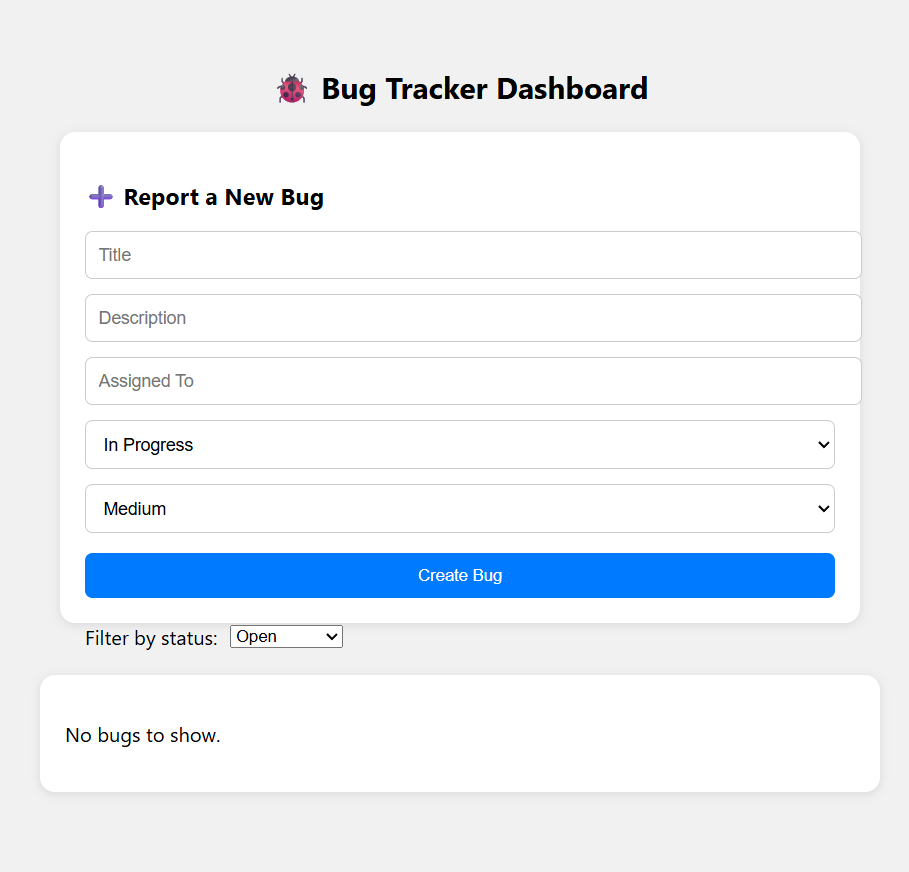

# 🐞 Bug Tracker Tool

A modern, full-stack **Bug Tracking System** built with the **MERN stack** (MongoDB, Express, React, Node.js) for Flipkart GRiD 7.0. This tool allows teams to log, track, and manage bugs efficiently with an intuitive UI and role-based access.

---

## 🔧 Tech Stack

| Frontend       | Backend         | Database | Auth         |
|----------------|------------------|----------|--------------|
| React (CRA)    | Node.js + Express | MongoDB  | JWT (JSON Web Token) |

---

## ✨ Features

✅ User Registration & Login  
✅ Role selection (`Admin`, `Developer`)  
✅ Submit new bugs with:
- Title, Description, Status, Priority, Assigned To  
✅ View bug list in a clean table format  
✅ Filter bugs by status (Open, In Progress, Closed)  
✅ Responsive & beautiful UI (CSS only, no UI libs)  
✅ Protected routes using JWT  
✅ Real-time list update on bug creation

---

## 🖼️ Screenshots





## 📦 How to Run Locally

> Make sure MongoDB is installed and running locally on port `27017`.

### ✅ 1. Clone the repository

```bash
git clone https://github.com/your-username/bug-tracker-tool.git
cd bug-tracker-tool
